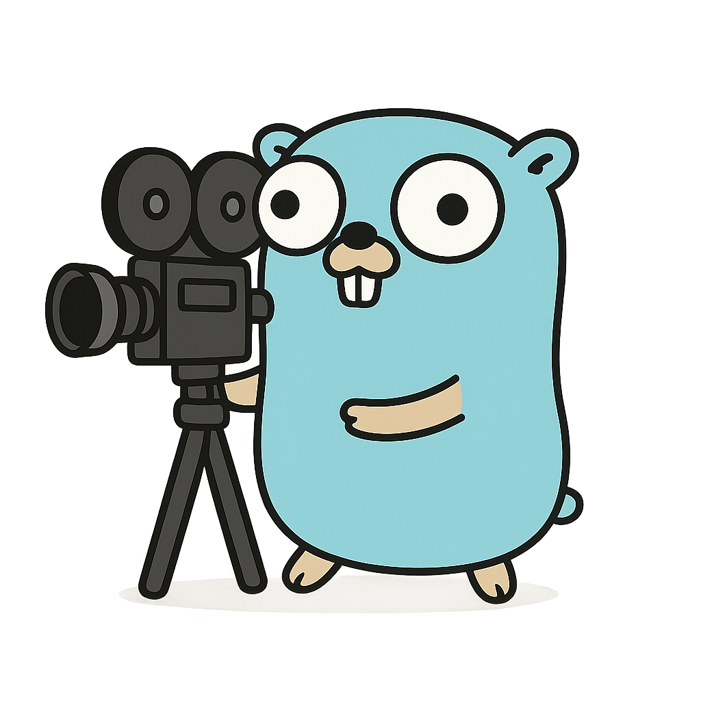

# kino

<p align="center">
  <picture>
    <br>
  </picture>
</p>

Lightweight field masking / projection for JSON in Go.

Supports two root modes:

* **Positive (include)** – default. Only explicitly included (positive) paths are emitted.
* **Negative (exclude)** – activated automatically when a mask expression contains only negative entries.

Uses the experimental [`encoding/json/v2`](https://github.com/go-json-experiment/json) package for fast streaming projection without materializing intermediate maps.

Inspired by / conceptually similar to [LinkedIn Rest.li Projections](https://linkedin.github.io/rest.li/Projections). kino aims to provide a lightweight, Go‑native subset focused on:

* Simple, compact expression syntax (no URI query expansion layer here).
* Runtime projection without schema code‑gen (works on any encodable value).
* Two root modes (include vs exclude) auto-detected to reduce boilerplate.
* Streaming application using `encoding/json/v2` to avoid intermediate allocations.

Not (yet) implemented vs full Rest.li projections:
* Wildcards / range selectors.
* Type/schema awareness or coercion.
* Renames, aliases, or value transformations.
* Conditional operators.

These may be added selectively if they can remain ergonomic and zero/low‑overhead when unused.

## Install

```bash
go get github.com/calumari/kino
```

## Quick example

Masking a simple struct (include only selected fields + nested subfield):

```go
package main

import (
	"fmt"

	"github.com/calumari/kino"
	"github.com/go-json-experiment/json"
)

type User struct {
	ID    int    `json:"id"`
	Name  string `json:"name"`
	Email string `json:"email"`
	Meta  struct {
		Plan     string `json:"plan"`
		Internal string `json:"internal"`
	} `json:"meta"`
}

func main() {
	u := User{ID: 1, Name: "Ada", Email: "ada@example.com"}
	u.Meta.Plan = "pro"
	u.Meta.Internal = "secret"

	// Keep id, name and meta.plan only.
	mask, _ := kino.ParseMask("id,name,meta:(plan)")
	out, _ := json.Marshal(u, json.WithMarshalers(kino.MarshalWithMask(mask)))
	fmt.Println(string(out)) // {"id":1,"name":"Ada","meta":{"plan":"pro"}}
}
```

Override example (exclude whole object but keep one child):

```go
mask, _ := kino.ParseMask("-meta:(plan)")
// Produces: {"meta":{"plan":"pro"}}
```

## Mask expression syntax

Compact, comma‑separated list of field specs:

* `a` include field `a`
* `-b` exclude field `b`
* `c:(d,-e)` include `c.d`, exclude `c.e`
* Nested: `f:(g,h)` include `f.g`, `f.h`
* Exclusion override: `-z:(-y,x)` exclude `z` but keep `z.x` (still exclude `z.y`)

Whitespace is ignored. Parentheses group a subtree after `field:`.

Root mode auto‑detection:

* If the expression has at least one positive (`a`) => `Positive`.
* If it has only negatives (`-a,-b`) => `Negative`.

## Parsing a mask

```go
mask, err := kino.ParseMask("a,-b,c:(d,-e),f:(g,h),i,-z:(-y,x)")
if err != nil { panic(err) }
fmt.Println(mask.Mode)        // Positive
fmt.Println(mask.String())    // stable string form
```

If you parse only negatives, e.g. `-a,-b`, `mask.Mode == Negative`.

## Applying a mask when marshaling

```go
import (
	"github.com/calumari/kino"
	"github.com/go-json-experiment/json"
)
projected, err := json.Marshal(value,json.WithMarshalers(kino.MarshalWithMask(mask)))
```

Arrays / slices inherit the same mask per element.

## JSON (de)serialization of Mask

Masks serialize to nested objects of booleans (true = include, false = exclude). Example:

```json
{"a":true,"b":false,"c":{"d":true,"e":false}}
```

Load with experimental unmarshalers (structure preserved):

```go
var m kino.Mask
if err := json.Unmarshal(data, &m, json.WithUnmarshalers(kino.MaskUnmarshalers())); err != nil { /* handle */ }
```

## Override includes inside excluded subtrees

In exclusion mode, a negative entry with children lets you selectively re‑include grandchildren:

Expression: `-z:(x)`

Result (given `{"z":{"x":1, "y":2}}`): `{"z":{"x":1}}`.
